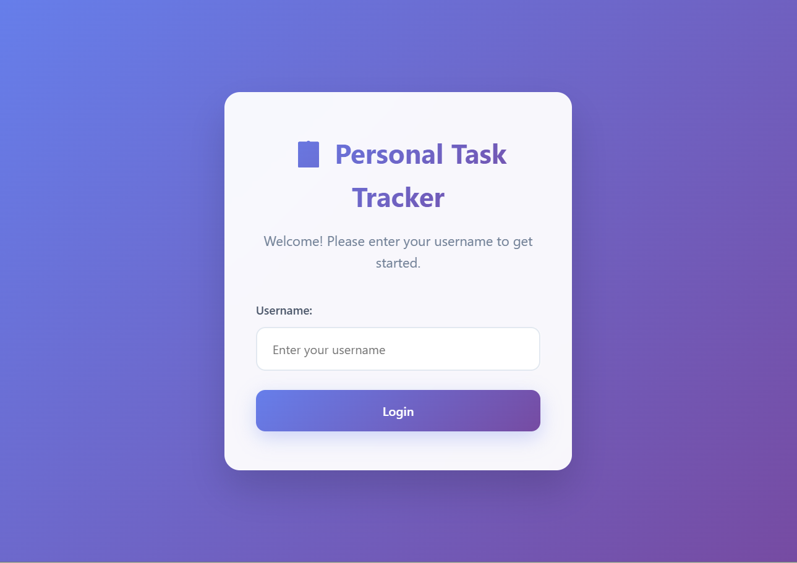
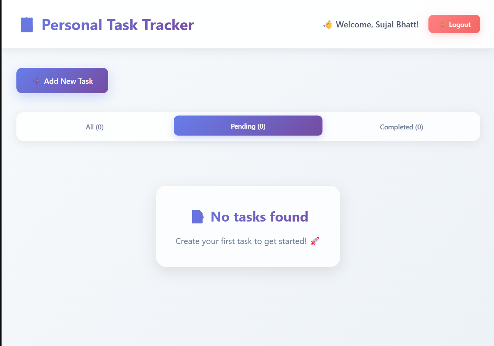
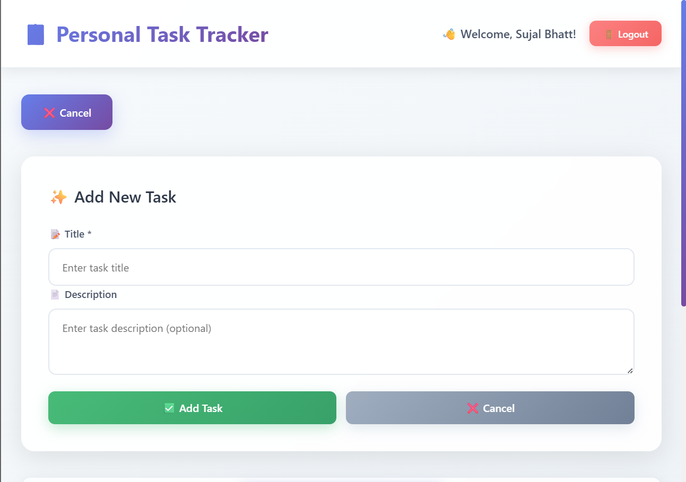

# TASKZEN

## 📖 Description
A simple and elegant personal task management application built with React. This application allows users to create, edit, delete, and track their tasks with a clean and responsive interface. Perfect for personal productivity and task organization.

## 🚀 Features
- **User Authentication**: Simple login system with username storage
- **Task Management**: Create, edit, delete, and mark tasks as complete
- **Task Filtering**: Filter tasks by All, Completed, or Pending status
- **Data Persistence**: All tasks are saved locally and persist after page refresh
- **Responsive Design**: Works seamlessly on both desktop and mobile devices
- **Real-time Updates**: Task counts update automatically
- **Clean UI**: Modern, intuitive interface with smooth interactions

## 🛠 Setup Instructions
1. Clone the repository
   ```bash
   git clone [your-repository-url]
   cd task-tracker
   ```

2. Install dependencies
   ```bash
   npm install
   ```

3. Start the development server
   ```bash
   npm start
   ```

4. Open [http://localhost:3000](http://localhost:3000) in your browser

## 🧰 Technologies Used
- **React.js** - Frontend framework
- **CSS3** - Styling and responsive design
- **localStorage API** - Data persistence
- **React Hooks** - State management (useState, useEffect)

## 🔗 Live Demo
[Add your deployed application URL here]

## 🖼 Screenshots

### Login Page


### Dashboard


### Mobile View


## 📁 Project Structure
```
task-tracker/
├── public/
│   └── index.html
├── src/
│   ├── components/
│   │   ├── Login.js          # User authentication component
│   │   ├── Dashboard.js      # Main dashboard component
│   │   ├── TaskForm.js       # Task creation form
│   │   ├── TaskItem.js       # Individual task display and editing
│   │   ├── TaskList.js       # Task list container
│   │   └── TaskFilter.js     # Task filtering component
│   ├── utils/
│   │   └── localStorage.js   # Data persistence utilities
│   ├── App.css              # Main stylesheet
│   ├── App.js               # Main application component
│   └── index.js             # Application entry point
├── package.json
└── README.md
```

## 🎯 Key Features Explained

### Authentication
- Simple username-based login
- No complex authentication - perfect for personal use
- Session persistence using localStorage

### Task Management
- **Create**: Add new tasks with title (required) and description (optional)
- **Edit**: Inline editing for quick task modifications
- **Delete**: Confirmation prompt prevents accidental deletions
- **Complete**: Toggle task completion status with visual feedback

### Data Persistence
- All data stored locally using localStorage
- No external database required
- Data persists across browser sessions

### Responsive Design
- Mobile-first approach
- Optimized for all screen sizes
- Touch-friendly interface

## 🚀 Getting Started
1. Enter your username to login
2. Click "Add New Task" to create your first task
3. Use the filter tabs to view different task categories
4. Edit or delete tasks as needed
5. Mark tasks as complete when finished

## 🔧 Development
This project was built using:
- Create React App for project setup
- Functional components with React Hooks
- Modern CSS with flexbox and grid
- localStorage for data persistence

## 📝 License
MIT LICENSE
